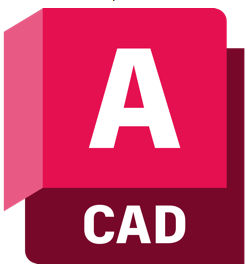

<!-- _coverpage.md -->

<!--  -->

# K Knowledge <small>1.0</small>

<table class="home-page-div" border="0">

  <tr class="home-page-row">
    <th class="home-page-col">
        

            </img>
            <a href="#/autocad/readme">AutoCAD</a>
        

    </th>
    <td class="home-page-col">
        

            </img>
            <a href="#/ylc/readme.md">xxx</a>
        

    </td>
  </tr>

  <!-- <tr class="home-page-row">
    <th class="home-page-col">
        

            </img>
            <a href="#/PTC/readme.md">PTC</a>
        

    </th>
    <th class="home-page-col">
        

            </img>
            <a href="#/plugins/readme.md">插件</a>
        

    </th>
  </tr>

 
  <tr class="home-page-row">
    <td class="home-page-col">
      

            </img>
            <a href="#/lab/readme.md">文档教程</a>
        

    </td>
  </tr> -->

</table>

